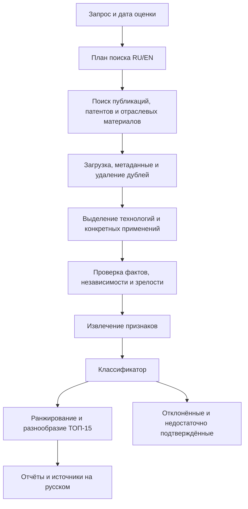

# Устаревший первоначальный аудит и план адаптации IDEA

> Архив: полезные выводы перенесены в актуальные документы `../01–06`. Оценки сроков и список признаков более не актуальны.

> После уточнения условий пользователем этот документ сохраняется как первоначальный аудит и расширенный план. Актуальный приоритетный план для хакатона находится в [HACKATHON_PLAN.md](HACKATHON_PLAN.md). Другой размеченной выборки у организаторов нет; обучение на Excel и ожидание скрытого тестового набора исключены из критического пути.

Дата анализа: 21 сентября 2026 года.

Основание: все 10 страниц `data/1. Газпромбанк.Тех.pdf`, включая схему и пример интерфейса; все 100 записей Excel; backend, схемы хранения, промпты, основной сценарий frontend и конфигурация развёртывания текущего приложения. Это план работ, а не отчёт о реализованном новом решении.

## 1. Основное решение

Сохранить FastAPI, полезные парсеры, компоненты отчётов, механизм экспертных комментариев и Docker-каркас. Построить новое аналитическое ядро вокруг цепочки «источник → наблюдение → технология в конкретном применении → признаки → классификация → объяснение → ранжирование».

Текущий проект генерирует исследовательские гипотезы из документов. Новая задача требует обнаруживать существующие ранние технологии, подтверждать их источниками и отделять от зрелых решений. Поэтому замены названия, промпта и шкалы оценки недостаточно.

Два режима должны использовать одинаковые определения признаков и совместимый классификатор:

1. **Оценка датасета:** структурированные записи → признаки → класс/оценка → выгрузка предсказаний и метрики, если доступны правильные ответы.
2. **Открытый поиск:** пользовательский запрос → поиск и загрузка источников → кандидаты → те же признаки и классификация → фильтрация → ТОП-15 → отчёты.

Доступные при инференсе поля могут отличаться. Если в закрытом тесте разрешено только описание, нельзя незаметно добавлять web-обогащение и сравнивать такой результат с моделью, работающей только по описанию. Режимы входа и недостающие признаки должны быть явно определены.

## 2. Что действительно требуется по ТЗ

| Требование | Следствие для реализации |
|---|---|
| Обучение модели и порог точности 75–80% | Нужны обучающая разметка, процедура обучения, независимая оценка и воспроизводимые предсказания |
| Precision, Recall, F1-score | Нельзя ограничиться средним баллом или долей найденных записей из положительного каталога |
| Объяснение по признакам | Объяснение должно соответствовать признакам, реально использованным для решения |
| Открытый запрос уже на промежуточном этапе | Поиск нужен до разработки полноценной панели |
| Реальный поиск за пределами стартовых данных | Excel не может быть единственной базой результатов |
| ТОП-15 на финале | Нужны более широкий пул кандидатов, проверка, объединение дублей и ранжирование |
| Исключение зрелых технологий, стандартов, хайпа и шума | Нужны явные причины отклонения и проверка признаков массового внедрения |
| Описание, преимущество, кейс, источники | Нужен структурированный отчёт для каждой технологии |
| Название, URL, дата, тип, язык, доверенность каждого источника | Нужна полноценная сущность источника, а не только ссылка в тексте |
| Русский интерфейс и аналитика | Оригинальные метаданные сохраняются, перевод/генеративное резюме маркируется |
| PostgreSQL в ожидаемом стеке | Перейти с SQLite на PostgreSQL, если иной вариант отдельно не согласован |
| Docker, демонстрация на ноутбуке | Выделить лёгкий основной контур; тяжёлый OCR и GPU не должны быть обязательны для каждого запуска |
| Ограниченный список облачных моделей | Проверять модель и провайдера по конфигурации, фиксировать каждый вызов |
| Презентация до 15 слайдов, публичный репозиторий, README | Подготовить сдаваемые материалы и проверить чистое развёртывание |

На промежуточном этапе достаточны API, CLI или простой UI. Полноценная аналитическая панель требуется к финалу. Статистика кандидатов, источников и сигналов с уверенностью выше 75% обозначена как преимущество, но реализовать её полезно сразу через реальные счётчики конвейера.

### Неопределённости, которые необходимо снять с организаторами

В разделе 2 говорится о размеченном датасете для обучения; в разделе 6.2 — о скрытой от участников разметке; приложен XLSX, хотя в ТЗ упомянут CSV/JSON. Нельзя молча считать, что это один и тот же набор с одинаковым назначением.

Нужно уточнить:

- Excel — положительные примеры методологии, тренировочная выборка или образец закрытого теста?
- Будет ли доступна размеченная обучающая часть с отрицательными примерами?
- Какой объект оценивается: технология, описание технологии или отдельная публикация?
- Какие поля доступны на тесте? Разрешены ли поиск и обогащение тестовых записей?
- Что именно означает «точность»: Accuracy, Precision, F1 или отдельная метрика детекции? Порог 80% считать целевым, 75% не трактовать как гарантированно достаточный.
- Какой формат результата, ограничения времени, сети и API-бюджета? На какую дату оценивается зрелость?
- Что делать с узким запросом, для которого не найдено 15 подтверждённых сигналов?

Эти вопросы не мешают делать импорт, схемы, извлечение признаков и открытый поиск. Они мешают корректно заявить качество на закрытой проверке.

## 3. Анализ примера данных

### Структура и проверенные числа

- Один видимый лист `Слабые сигналы`, диапазон содержательной таблицы `B2:J102`.
- Первая строка — объединённый заголовок `B1:J1`, вторая — названия колонок, третья–102-я — 100 записей. Колонка A пустая.
- Девять полей: №, технология, область, компании, объяснение слабого сигнала, стадия, тренд упоминаний, балл, источники.
- Пропусков в этих полях у 100 записей нет; точных повторов названия технологии нет.
- Области: Edge — 16, защита ИИ — 16, индустриальный ИИ — 17, инфраструктура ИИ — 17, роботы — 17, финтех — 17.
- Баллы: 7 — 15 записей; 6 — 28; 5 — 28; 4 — 22; 3 — 7. Таблица отсортирована по убыванию балла.
- В колонке источников 285 вхождений URL, 283 уникальных URL по строковому сравнению. У одной записи 1 ссылка, у 13 записей 2 ссылки, у 86 записей 3 ссылки.
- Ссылки записаны Markdown-текстом в ячейках, Excel-гиперссылок нет. Формул и комментариев в книге нет.
- Среди источников есть научные платформы, официальные сайты, отраслевые медиа, блоги и пресс-релизы. Количество ссылок не означает количество независимых подтверждений.

### Почему этих данных недостаточно для честной оценки классификатора

Все строки представлены авторами как слабые сигналы; отдельной целевой колонки с классом и явных отрицательных примеров нет. Балл 3 не означает «не слабый сигнал»: эти записи тоже включены в положительный каталог.

Нельзя объявлять записи с баллом 6–7 положительными, а 3–5 отрицательными без согласования определения цели. Это подменит задачу классификации задачей воспроизведения авторского ранга. Нельзя считать балл вероятностью: шкала не откалибрована и её точная формула в книге не дана.

Опасные источники утечки:

- Колонка «Почему это слабый сигнал» уже содержит готовый аналитический вывод.
- Балл и номер записи связаны с сортировкой и авторским ранжированием.
- Стадия и тренд могут быть полезными признаками, но только если разрешены на тесте либо независимо извлекаются тем же процессом из исходных данных. Нельзя обучаться на экспертном поле и ожидать того же качества от автоматически восстановленного поля без отдельной проверки.
- Название файла, листа и заголовки не должны попадать в признаки модели.
- Примеры из будущей тестовой части нельзя включать в few-shot промпты, справочник готовых ответов или настройку порогов.

### Смысловые особенности

Авторы часто считают сигналом **узкий вариант применения известной технологии**. Например, федеративное обучение встречается в контексте приватного развёртывания, межбанковского AML и взаимодействия заводов. Одно широкое имя технологии не определяет статус сигнала.

Нужна единица анализа: **технология + конкретное применение + рынок/география, если значимы + дата оценки**. Наличие крупной компании или большого раунда само по себе не доказывает зрелость всего применения.

Есть потенциально пересекающиеся группы: орбитальные вычисления №18/59, фотонный инференс №47/60, аналоговые вычисления в памяти №44/84, нейроморфные чипы №8/45/80, идентичность агентов №2/91. Их нужно проверить как группы связанных технологий. Различные применения не следует автоматически склеивать, но близкие варианты и общие публикации нельзя бесконтрольно распределять между train/test.

### Примеры проблем, требующих проверки первоисточников

- В №35, ячейке H37, в сентябрьском каталоге упомянут саммит в ноябре 2026 года. Будущее мероприятие можно учитывать как анонс, но не как уже состоявшееся подтверждение.
- В №47 и №60 сумма $312M для OLIX связана с разными месяцами: августом и февралем. Нужно проверить, разные ли это события или несогласованность описания.
- В №18 подпись источника и текст говорят о $250M, а URL содержит `raises-200-million`. Сам URL не доказывает ошибку, но это конкретный повод сверить статью.
- В №85 авторы прямо отмечают, что публикации восходят к одному анонсу. Три домена здесь нельзя автоматически считать тремя независимыми экспериментальными подтверждениями.

Полная доступность всех 283 URL и достоверность содержащихся в них утверждений в рамках этого анализа не проверялись. Указанные расхождения — наблюдения внутри книги, а не утверждение, что источники вымышлены.

## 4. Аудит существующего приложения

### Что сохранить

| Компонент | Что полезно | Как адаптировать |
|---|---|---|
| `app/main.py` | FastAPI, базовые маршруты, загрузка, экспорт | Разделить маршруты, сервисы, фоновые задания и отчёты |
| `app/document_parser.py` | PDF/DOCX/TXT/CSV/XLSX, OCR, метаданные | Сохранить парсинг документов, добавить отдельный структурированный импорт датасетов |
| `app/openai_service.py` | API-обёртка, JSON Schema, сбор поисковых ссылок | Разделить поиск, извлечение фактов и формирование отчётов; убрать старые доменные инструкции |
| `app/db.py` | Сущности проектов, комментариев, событий | Перенести полезные паттерны в новую схему PostgreSQL |
| `app/static/app.js` | Карточки, отчёты, отображение источников, feedback | Сделать главными поиск, выдачу и причины решений |
| `app/static/graph-engine.js` | Canvas-граф, фильтры, навигация | Использовать позже для связей технологий и подтверждений |
| Docker/Compose | Основа локального запуска | Добавить PostgreSQL, worker, healthcheck; выделить необязательные тяжёлые зависимости |

### Критические расхождения

1. **Нет обучаемого классификатора и evaluation pipeline.** В проекте нет подготовки train/test, обучения, сохранения модели, расчёта Precision/Recall/F1. Обратная связь включается в промпт; это не переобучение ML-модели.

2. **Другая целевая задача.** `generate_hypotheses()` и инструкции в `openai_service.py` ориентированы на металлургию, реагенты, лабораторные эксперименты и KPI. Эти предпосылки присутствуют также в создании проекта на frontend, схемах и defaults БД.

3. **Старый скоринг не измеряет слабость сигнала.** `knowledge.py:67` считает взвешенную сумму новизны, реализуемости, эффекта и обратного риска. Подстановка `(20, 95, 95, 5)` даёт 76,2, а `(90, 30, 80, 70)` — 62,5. Это иллюстрация свойств формулы: она способна предпочесть удобное зрелое решение рискованному раннему направлению. Результат нельзя показывать как вероятность класса.

4. **Таблица теряет структуру и почти целиком выпадает из прямого контекста.** `_parse_xlsx()` создаёт текст, а `_documents_context()` берёт до 3500 символов каждого из первых десяти документов. На данном XLSX получено 91 752 символа; прямой контекст содержит названия только №1–4 и обрывается внутри №4. Граф имеет отдельный путь извлечения и тоже ограничен; он не гарантирует сохранение всех 100 записей.

5. **Эвристический граф даёт ложные сущности.** `DOMAIN_TERMS` содержит металлургические обозначения, которые ищутся подстрокой. В изолированных проверках `security` породило «медь», `agent` — «серебро», `autonomous` — «золото», `community` — «никель». Совместное упоминание также не доказывает причинную связь. Существующую логику нельзя использовать как доказательство слабого сигнала.

6. **Поиск пока даёт сводку, а не проверяемый корпус.** `research_topic()` возвращает краткий текст и URL/title/text из annotations. В приложении нет независимого сохранения загруженных страниц, извлечённых дат, типа и языка источника, происхождения фактов, проверки независимости публикаций и противоречий. Поисковые метаданные возвращаются в API, но отдельной постоянной сущности запуска исследования нет.

7. **Поиск необязателен и может дать ноль источников.** В API `research_enabled=False` по умолчанию, хотя checkbox в UI включён. Непустая сводка с пустым списком citations не отклоняется. Для открытой итоговой выдачи нужна проверка наличия подтверждений.

8. **Ограничения не соответствуют ТОП-15.** Схема генерации допускает максимум 10 гипотез; поиск сохраняет максимум 12 источников, текущий runtime default — 8, UI default — 6. Простого повышения лимита недостаточно: нужно сначала получить разнообразный пул кандидатов.

9. **SQLite вместо ожидаемой PostgreSQL.** Сейчас результаты и JSON-поля хранятся через `sqlite3`; исходные загруженные файлы — на диске. Для нового корпуса нужны новые сущности и миграции.

10. **Конфигурация моделей расходится с ТЗ.** В коде и Compose default `gpt-5.2`, которого нет в перечисленном разрешённом списке. При произвольном `base_url` включается ветка с web-плагином для OpenRouter-подобного сервиса. По ТЗ такие внешние маршруты требуют согласования с организаторами. Нужны явная разрешённая конфигурация и журнал выбранной модели; текущие имена в логах — полезная основа.

11. **Нулевые оценки превращаются в 50.** В `db.py:461` и соседних полях используется `value or 50`. Изолированная запись нулевых novelty/feasibility/impact/risk/score в временную БД вернулась как пять значений 50. Исправить, если этот код переиспользуется. Также убрать неоднозначное автоматическое угадывание шкал 0–1/0–10/0–100.

12. **Прогресс интерфейса не отражает работу сервера.** `generationBusyStages()` и `startBusyStages()` рассчитывают этапы по времени. Для новой системы показывать реальные статусы заданий и количество обработанных объектов.

### Второстепенные, но полезные исправления

- PDF с текстовой подписью и большой схемой может потерять саму схему: текущий парсер принимает достаточно длинный text-layer и не анализирует изображение. На странице 3 данного PDF извлечена подпись схемы, vision-задачи не сформированы. Для таблиц и рисунков в научных источниках нужен отдельный режим.
- Скрипт-детекция `en/latin` означает латиницу, а не доказанный английский язык. Она не заменяет определение языка источника.
- Импорт всей папки `data` захватит и техническое задание. Разделить документацию задачи, примеры, train/test и корпус открытых источников.
- README предлагает копировать `.env.example`, но файл отсутствует. Зависимости заданы нижними границами без фиксированного проверенного окружения. В репозитории нет набора автоматических тестов и CI.
- Для публичного стенда проверить изоляцию проектов, доступ к административным операциям и принадлежность объектов проекту. `X-User` сейчас является произвольной подписью, а не аутентификацией.
- Проверка URL при отображении уже есть. При появлении серверного загрузчика отдельно нужны ограничения сетевого доступа, размера и времени загрузки, чтобы URL из найденных документов не приводили к чтению внутренних ресурсов.

## 5. Предлагаемая методология

### Формализация класса

Рабочее определение: слабый сигнал — подтверждённое наблюдениями раннее изменение в конкретной технологии или её применении, имеющее потенциальную значимость, при ещё ограниченном распространении и несформировавшемся массовом рынке.

Малая известность сама по себе недостаточна. Устаревшая забытая технология, единичное рекламное обещание и плохо найденная информация не должны автоматически становиться слабыми сигналами.

Полезные внутренние решения:

- `weak_signal`: есть поддержка ранней стадии и значимого изменения;
- `mature`: подтверждено массовое внедрение/зрелость именно данного применения;
- `hype_or_noise`: утверждения не подкреплены содержательными свидетельствами;
- `irrelevant`: не соответствует запросу;
- `insufficient_evidence`: данных недостаточно для вывода.

Последние четыре состояния не обязательно обучать как пять отдельных классов на маленькой выборке. Базовая модель может быть бинарной, а причины, релевантность и достаточность доказательств — отдельными проверками. Отображение внутренних состояний в официальный формат сдачи согласовать с контрактом теста.

### Признаки

| Группа | Что извлекать | Что не следует подменять |
|---|---|---|
| Стадия | Исследование, PoC, пилот, ограниченное внедрение, масштабирование | Seed-раунд не равен технологической готовности |
| Распространение | Число и масштаб внедрений, публичные кейсы, доступность продукта | Неизвестное число внедрений не равно нулю |
| Зрелость рынка | Повторяемые закупки, стандартизация, массовые предложения, стабильная структура рынка | Наличие одного лидера или большого вендора не является самостоятельным запретом |
| Динамика | Новые независимые события и документы в сравнимых окнах | Число результатов поисковика не является надёжным временным рядом |
| Новизна | Что изменилось относительно известного решения в данном применении | Возраст термина не равен возрасту конкретного применения |
| Доказательства | Первичный источник, реальные данные, воспроизводимый прототип, пилот | Репосты одного анонса не являются независимыми экспериментами |
| Значимость | Конкретная проблема, измеримое или объяснимое преимущество | Размер инвестиций не доказывает технический эффект |
| Шум | Повторяемые рекламные заявления, отсутствие деталей, противоречия | Низкая медийность не доказывает инновационность |

Каждый извлечённый признак хранить со значением, источником, подтверждающим фрагментом, датой, способом извлечения и состоянием `known/unknown/conflicting`. LLM-оценку нельзя записывать как измеренный факт без происхождения.

Для временной динамики сначала обеспечить сравнимый корпус и дедупликацию. При достаточных данных считать, например, число независимых публикаций за последние 90 дней и предыдущие 90 дней, со сглаживанием и минимальным объёмом наблюдений. Нормировать относительно направления и охвата источников. При недостаточном покрытии указывать отсутствие измерения. Рост публикаций — только один признак, не обязательное условие для каждого раннего сигнала.

### Обучаемая модель

Начать с трёх сравнимых вариантов:

1. Правила по ранней стадии, зрелости и доказательствам — прозрачный baseline, без заявления о supervised-обучении.
2. TF-IDF + логистическая регрессия по разрешённым текстовым полям — дешёвый baseline для сравнения.
3. Логистическая регрессия на небольшом наборе явно определённых признаков, извлекаемых правилами и LLM. Это предпочтительный первый кандидат на основную модель благодаря понятной связи признаков с решением.

Позже сравнить компактные multilingual embeddings и более сложный табличный классификатор, только если ошибки показывают необходимость. Не начинать с дообучения большой LLM на 100 однотипных положительных примерах.

Для линейной модели объяснять локальные вклады признаков в log-odds, а не выдавать коэффициенты за проценты вероятности. Текстовое объяснение строить по сохранённым признакам и доказательствам после принятия решения.

Три разных величины хранить раздельно:

- `signal_probability` — оценка принадлежности к классу, калибруемая на независимых размеченных данных;
- `evidence_quality` — качество и полнота подтверждений;
- `rank_score` — порядок в выдаче с учётом релевантности, потенциальной значимости и разнообразия.

До проверки калибровки показывать, что оценка предварительная. Нельзя называть произвольное число от LLM или взвешенную сумму бизнес-критериев статистически подтверждённой уверенностью.

### Разметка и валидация

Если организаторы дают полноценную train-часть — использовать её как основную. Если доступны только эти 100 положительных примеров — сформировать отдельный обучающий корпус с экспертной разметкой. Практический ориентир первого расширения: 200–400 записей суммарно, включая зрелые технологии, шум и трудные пограничные случаи; это рабочая оценка объёма, не гарантия качества.

Отрицательные примеры брать из реальных источников в тех же направлениях, языках и периодах. Не создавать весь negative-класс только короткими синтетическими фразами: модель иначе выучит стиль происхождения. Не помечать автоматически любую неизвестную технологию как отрицательную. Спорные случаи отдельно пересматривать по инструкции разметки.

Сначала определить связанные группы технологий и публикаций, затем выделить неизменяемый holdout. Преобразования, выбор признаков, few-shot примеры, подбор порогов и калибровку обучать только внутри train/validation. При достаточном количестве групп использовать групповую стратифицированную кросс-валидацию. Дополнительно проверить перенос на отложенное направление и временной срез, если объём данных это позволяет.

Отчёт: Accuracy, Precision, Recall, F1, balanced accuracy при дисбалансе, confusion matrix, объём и распределение выборки, интервалы неопределённости, ошибки по областям, сравнение с baseline. Отдельно оценить качество извлечения признаков на вручную проверенной подвыборке. Если есть отказ от решения, публиковать coverage и не удалять такие записи из метрики незаметно.

Без ground truth невозможно честно подтвердить 80%. Метрики на собственном корпусе и на официальной закрытой проверке должны быть обозначены отдельно.

## 6. Конвейер открытого поиска



1. Нормализовать запрос, выделить область, ограничения и дату. Построить несколько поднаправлений и RU/EN-запросов. Не ограничиваться шестью областями Excel.
2. Искать через заменяемые адаптеры. Для первого вертикального сценария достаточно web-поиска и одного научного источника; дальнейшие кандидаты — arXiv/OpenAlex и официальный патентный источник EPO OPS после проверки доступа. Не обещать свободный неограниченный доступ к патентным API.
3. Сохранять поисковый запрос, найденный URL, время получения, реальный статус загрузки и исходный документ/ответ. Доступность URL, содержание страницы и подтверждение конкретного вывода — три разные проверки.
4. Извлекать название, дату публикации, дату события при наличии, тип, язык, организацию, основной текст. Не придумывать дату, если её нет. Для источников за пределами разрешённой даты — отдельное состояние и исключение из исторической оценки.
5. Удалять технические дубли URL, зеркала и перепечатки. Объединять материалы об одном событии и фиксировать общего первоисточника. Дата статьи и событие из неё могут относиться к разным периодам.
6. Извлекать кандидатов «технология + применение», а не считать каждый документ отдельным трендом. Сохранить связь многих документов с одним кандидатом и одного документа с несколькими кандидатами.
7. Для кандидатов выполнить дополнительный поиск подтверждений и контрдоказательств: массовые внедрения, текущие продукты, сформированный рынок, стандарты, независимые испытания. Отсутствие найденного результата не трактовать как доказательство отсутствия рынка.
8. Классифицировать и сформировать причины включения/отклонения. Для спорных кандидатов хранить противоречия и недостающие данные.
9. Выбирать 15 разных подтверждённых сигналов. Ранжировать после проверки класса и зрелости, а не компенсировать массовое внедрение высоким бизнес-эффектом. При слишком узком пуле расширять поисковые подзапросы в рамках бюджета.
10. Если подтверждённых результатов всё равно меньше 15, показать реальное число и причину. Это не полное выполнение финального требования, но выдумывать оставшиеся нельзя. Недостаток покрытия должен стать отдельным объектом оптимизации до демонстрации.

Начальные инженерные ориентиры одного широкого запроса: 40–80 кандидатов и примерно 80–150 документов до фильтрации. Проверить эти бюджеты экспериментально; не считать их требованиями ТЗ. Не выполнять отдельный LLM-вызов для каждой пары «кандидат × все документы». Использовать пакеты извлечения, кэш и точечное углубление.

## 7. Данные и архитектура приложения

Основной стек: существующий FastAPI, PostgreSQL, отдельный Python worker, локальная небольшая ML-модель и явно выбранная разрешённая LLM для извлечения/резюме. Redis и дополнительную очередь вводить только при необходимости; для первого стенда допустима очередь заданий с состоянием в PostgreSQL. Главное — долговечные статусы, восстановление и ограничение параллелизма.

### Минимальные сущности

| Сущность | Основные поля |
|---|---|
| Dataset / DatasetRecord | Версия, происхождение, исходный ID, разрешённые входные поля, аннотации отдельно, split/group, дата среза |
| SearchRun | Запрос, дата оценки, конфигурация, стадия, реальный прогресс, время, бюджет, ошибки |
| Source / SourceDocument | URL/canonical URL, оригинальное название, дата, язык, тип, организация, доверенность с основаниями, raw content, hash, статус загрузки |
| Observation / Evidence | Факт, source ID, точный фрагмент/локатор, дата события, подтверждает/опровергает, происхождение |
| TechnologyCandidate | Нормализованное название, применение, aliases, области, компании, группа дублей |
| FeatureSnapshot | Значения, пропуски, противоречия, evidence IDs, версия извлечения |
| Prediction | Класс, вероятность/скоринг, признаки, причины, версия модели и порога |
| RankedResult / Report | Место, преимущества, кейсы, неопределённости, причины ранга, source/evidence IDs |
| Review / ModelRun | Решение эксперта и история; для вызовов — модель, провайдер, роль, версия промпта, время, токены/стоимость при наличии |

Не связывать доказательство только с URL: при обновлении сайта должна сохраняться версия прочитанного материала. Генерируемое резюме хранить отдельно от сырого источника. Ссылки в отчёте разрешать только из сохранённых source IDs; при прямой цитате проверять её наличие в извлечённом тексте.

Пример распределения модулей:

```text
app/
  api/             # поиск, датасеты, сигналы, отчёты, экспертные решения
  ingestion/       # импорт XLSX/CSV/JSON, извлечение документов
  sources/         # поиск, загрузка, метаданные, доверенность, дубли
  analysis/        # кандидаты, признаки, зрелость, ранжирование, объяснения
  ml/              # обучение, инференс, калибровка, оценка
  llm/             # явные провайдеры, схемы извлечения, журналирование
  reports/         # русский отчёт и экспорт
  persistence/     # модели PostgreSQL, репозитории, миграции
  jobs/            # worker, статусы, retry, восстановление
scripts/
  import_dataset.py
  train.py
  evaluate.py
  predict.py
tests/
```

Предварительный API: создание поиска `POST /api/searches`, получение состояния и событий запуска, список результатов и отклонённых кандидатов, детальный сигнал с доказательствами, импорт и пакетное предсказание для датасета. Формат официального submission сделать отдельным адаптером после получения требований.

## 8. Последовательность реализации

Оценки ниже — ориентир в человеко-днях для одного разработчика, знакомого с проектом, с доступными API и без ожидания организаторов. Это не обещание срока. Самая неопределённая часть — разметка, доступ к источникам и проверка качества.

| Этап | Работы | Результат и критерий готовности | Оценка |
|---|---|---|---|
| 0. Контракт задачи | Матрица требований, определение класса, разрешённые модели, входы/выходы, дата оценки | Зафиксированы допущения и открытые вопросы; исключён default недопустимой модели | 0,5–1 |
| 1. Структурированные данные | Импорт XLSX/CSV/JSON, schema validation, URL parsing, профиль данных, отделение аннотаций | Все 100 записей импортируются отдельно, поля и происхождение сохранены; никакой потери через 3500 символов | 1 |
| 2. Основа приложения | PostgreSQL, миграции, состояния jobs, журнал вызовов, конфигурация | API и worker стартуют через Compose; результаты сохраняются и восстанавливаются | 1–2 |
| 3. Baseline и разметка | Инструкция разметки, train/holdout, отрицательные примеры, признаки, простые модели | Есть воспроизводимые предсказания и объяснения; если размеченного набора нет — честный baseline без фиктивных метрик | 2–3 плюс разметка |
| 4. Вертикальный открытый поиск | Запрос → адаптеры → реальные документы → кандидаты → признаки → результат | Незнакомый запрос обрабатывается вне Excel; каждый вывод имеет источник; ошибки сбора видны | 2–3 |
| 5. Качество выдачи | Контрдоказательства, зрелость, независимость источников, объединение кандидатов, ранжирование, калибровка | Проверяемый ТОП-15 на широких направлениях, список отклонений, отчёт об ошибках | 2–3 |
| 6. Панель и отчёт | Главный поиск, список, документ-инсайт, источники, причины, реальные счётчики | Пользователь видит путь от факта к решению, русский текст и отметки генеративных резюме | 1,5–2,5 |
| 7. Сдача | Чистый запуск, отказоустойчивость, benchmark, README, методология, презентация, репетиция | Воспроизводимый запуск и демонстрация нового направления с сохранённым журналом | 1,5–2,5 |

Общий ориентир: около 12–18 рабочих человеко-дней плюс время на экспертную разметку и внешние зависимости. Сокращённый вариант следует получать уменьшением числа коннекторов и UI-функций, сохраняя проверяемость данных и методологию.

**Промежуточная сдача:** завершены этапы 0–4, добавлены базовые проверки зрелости и источников из этапа 5; представлены метрики на доступной размеченной выборке с честным указанием её происхождения. Полированный UI не является условием.

**Финальная сдача:** этапы 0–7, полный сценарий ТОП-15, отчёты и демонстрация исключений на запросе жюри.

## 9. Проверки, которые должны защищать качество

### Данные и ML

- Импорт 100 отдельных записей, устойчивость к дополнительной строке заголовка, нескольким листам и изменённому порядку колонок.
- Корректная обработка Markdown URL, пустых дат, смешанных стадий, повторных материалов и разных языков.
- Запрет попадания экспертного объяснения, балла, номера строки и test-примеров в train-признаки и few-shot контекст.
- Ноль не превращается в default; неизвестное значение отличается от нуля; фиксированы типы и шкалы.
- Дубли/близкие записи и общие первоисточники не загрязняют holdout.
- Одна и та же версия извлечения признаков и классификатора воспроизводит пакетный результат.
- Отдельно проверены извлечение фактов, классификация и калибровка; отчёт содержит размер выборки и ошибки.

### Открытый поиск

- Новый запрос, отсутствующий в каталоге, запускает реальный поиск.
- Известная зрелая технология отклоняется по конкретному доказательству; узкое новое применение не отклоняется только из-за известности базовой технологии.
- Один пресс-релиз и его перепечатки не образуют независимый набор подтверждений.
- Недоступная страница, пустой поиск, 429, timeout, некорректный JSON, конфликт дат и перезапуск worker отражаются в результате.
- Будущая дата и анонс не превращаются в состоявшееся событие.
- В отчёте нет URL вне реестра прочитанных источников и неподтверждённых прямых цитат.
- Текст источника не может менять системные инструкции извлечения, разрешённые инструменты и адреса загрузки.
- Измеряются Precision@15 по экспертному просмотру, доля зрелых технологий в выдаче, доля подтверждённых утверждений, дубли и разнообразие. При выдаче меньше 15 фиксируется также фактический размер списка.

### Демонстрация

- Чистое развёртывание из README, включая существующий `.env.example`, миграции и проверенные зависимости.
- Измерение p50/p95 времени, числа запросов и стоимости на серии фиксированных направлений. Конкретный SLA назначить после первого замера и согласования времени демонстрации.
- Полезные стадии появляются по мере реальной обработки; повторный запуск использует явно обозначенный кэш.
- Живой режим демонстрируется отдельно от воспроизведения сохранённого запуска. Кэш не выдаётся за новый поиск.
- Для каждого из 15 результатов открывается русский отчёт с преимуществом, реальным кейсом или явно помеченным предполагаемым применением, причинами решения и метаданными источников. Отсутствующий реальный кейс не придумывается.
- Презентация до 15 слайдов показывает задачу, данные, методологию, признаки, оценку, архитектуру, поиск, фильтрацию зрелых технологий, продуктовую ценность и ограничения.

## 10. Что отложить

- Новый 3D-граф и усложнение анимаций до достижения качества классификации и поиска.
- Дообучение большой LLM до появления достаточной разметки и результатов baseline.
- Автоматическое самообучение по лайкам: экспертное подтверждение класса и субъективная полезность — разные сигналы.
- Полноценную экономическую модель и обязательный лабораторный roadmap для каждой технологии. ТЗ прежде всего требует преимущество и релевантный кейс.
- Множество нестабильных скрейперов, обязательный GPU, графовую СУБД и отдельную векторную инфраструктуру без измеренной необходимости.

Если требуется соответствовать React из ожидаемого стека, текущие карточки перенести в небольшой React-интерфейс после стабилизации API; Canvas-граф можно обернуть. Для промежуточной сдачи существующий frontend или простой API достаточны. Сохранение vanilla JS на финале лучше заранее сверить с трактовкой ожидаемого стека организаторами.

## 11. Объём выполненной проверки

В этом анализе прочитаны постановка, схема, пример интерфейса, структура и содержимое 100 записей, основные backend/frontend-модули и конфигурация. Выполнены изолированные проверки парсера XLSX, формирования контекста, эвристического графа, записи нулевых оценок и повторного upsert графа во временную SQLite. Python-файлы прошли синтаксический разбор AST.

Приложение целиком и Docker-сборка не запускались, облачные LLM-запросы не выполнялись, качество будущего классификатора не измерялось. В доступном bundled Python нет FastAPI, PyMuPDF и HTTPX, поэтому интеграционный запуск не проверен. Рабочие файлы приложения, входные данные и существующие изменения README не редактировались.

### Технические источники для предложенного подхода

- [Scikit-learn: утечка данных и Pipeline](https://scikit-learn.org/stable/common_pitfalls.html).
- [Scikit-learn: LogisticRegression](https://scikit-learn.org/stable/modules/generated/sklearn.linear_model.LogisticRegression.html).
- [Scikit-learn: групповая стратифицированная валидация](https://scikit-learn.org/stable/modules/generated/sklearn.model_selection.StratifiedGroupKFold.html).
- [Scikit-learn: калибровка вероятностей](https://scikit-learn.org/stable/modules/calibration.html).
- [arXiv API](https://info.arxiv.org/help/api/user-manual.html).
- [OpenAlex: справочник доступа и API](https://help.openalex.org/).
- [EPO Open Patent Services](https://www.epo.org/en/searching-for-patents/data/web-services/ops).

Выбор конкретных провайдеров и лимитов нужно подтвердить интеграционной проверкой. Допустимость облачной модели определяется приложенным ТЗ и согласованиями организаторов, а не наличием технического доступа к API.
